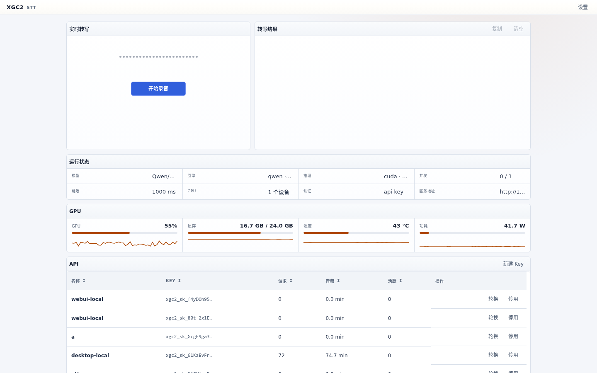
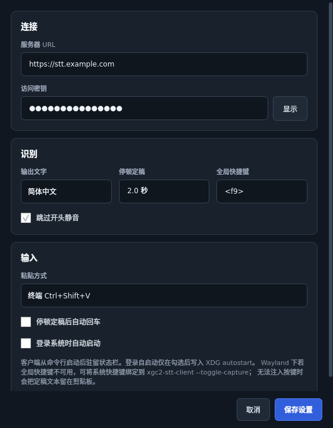
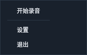
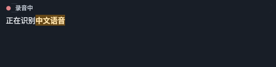

# XGC2 STT

Self-hosted, GPU-accelerated streaming speech recognition with a management
WebUI demo, an HTTP/WebSocket API, and a native Linux desktop client. Release
images contain the selected model weights, so a deployment does not download
models at first start.

This repository publishes software, not a public speech-recognition service.
It does not include a hosted endpoint, operator address, API key, or private
registry. Desktop users connect to a service operated by themselves or their
organization and enter its URL and key during initial setup.

## Components

| Component | Purpose |
| --- | --- |
| GPU service | Model runtime, local management WebUI demo, API-key administration |
| API gateway | HTTP and WebSocket speech-recognition endpoints without the management UI |
| Desktop client | Tray application for X11 and Wayland, global shortcut or CLI toggle, preview and text insertion |

The management interface and client-facing API are separate trust boundaries.
Keep management access on loopback or a private administration network. Put
the client API behind an HTTPS/WSS reverse proxy before allowing remote use.

## Images

The service Dockerfile starts from XGC-built images in `xgc2-images`.
`xgc2-stt-dev` already contains the WebUI toolchain and test extras.
`xgc2-stt-runtime` already contains vLLM, sox, tini, qwen-asr, and the
frozen service Python set. This repository does not `FROM` stock
`node` / `vllm` images and does not `apt-get` / `uv sync` / `npm ci` in CI.
If a new dependency is required, add it in `xgc2-images` and rebuild that
image.

The following self-contained images share the same API:

| Tag | Embedded model | Streaming mode |
| --- | --- | --- |
| `qwen-0.1.0` | Qwen3-ASR-1.7B | Revision-capable chunked recognition |

`qwen-0.1.0` is a frozen historical image reference and is not republished.
The image workflow now accepts publication only through an explicit dispatch
for the exact current `main` commit and a previously unused `qwen-X.Y.Z` tag.
It never publishes moving `base`, `qwen`, `latest`, or SHA aliases. A new image
therefore requires a new service version and creates exactly one immutable tag.

Images are published to:

```text
ghcr.io/xgc-team/xgc2-stt-service:<tag>
```

Private mirrors are deployment configuration and are not recorded in this
repository. The exact model revisions are pinned in the Dockerfile. Model
weights live under `/opt/xgc2-stt/models` in each variant image; the writable
cache volume contains only runtime and compilation state.

## Self-hosting

Prerequisites:

- Docker Compose v2
- NVIDIA Container Toolkit
- NVIDIA Linux driver `575.57.08` or newer; the 580 series is recommended
- A 24 GB NVIDIA GPU for the supplied production profiles

No host CUDA Toolkit is required. Copy the environment template, choose your
own bind addresses and ports, then deploy an embedded-weight image:

```bash
cp .env.example .env
${EDITOR:-vi} .env
./scripts/deploy-local.sh
```

The deployment script pulls the image, starts or replaces the containers, waits
for model readiness, and prints status. It does not download weights at runtime.

For manual Compose operation:

```bash
docker compose pull
docker compose up -d --force-recreate
docker compose ps
```

Verify the API through the URL selected for this deployment:

```bash
STT_API_URL='https://stt.example.com'
curl -fsS "${STT_API_URL}/healthz"
curl -fsS "${STT_API_URL}/readyz"
docker compose exec stt nvidia-smi
```

The example hostname is documentation-only. Replace it with an endpoint you
control. Do not expose the management origin through the public API proxy.

The default runtime reserves a large GPU-memory pool for predictable vLLM
execution. This reservation is not the size of the model weights. Reduce
`STT_GPU_MEMORY_UTILIZATION` for a single-user installation when other GPU
workloads need headroom, then restart the model from the WebUI. Lower values
must be validated with realistic utterances before production use. The supplied
profiles are not intended for an 8 GB GPU without separate tuning.

## Management WebUI



The GPU service serves an in-process **demo / operator panel** on the management
URL configured in `.env`. It is not a separately packaged web client. The UI
provides:

- model readiness and cached NVML GPU history;
- API-key creation, rotation, revocation and per-key usage;
- microphone-based streaming recognition against the API origin you configure;
- runtime settings and explicit restart boundaries.

Reusable capture, transcript, and connection chrome for product embedding lives
in [`@xgc2/ui-react`](https://github.com/XGC-Team/xgc2-ui) (`SpeechClientWorkspace`
and related components). This service consumes that package; later product
frontends should embed the same shared UI rather than copying this demo.

Generated API-key secrets are returned once. Only SHA-256 digests are stored
in the persistent data volume. NVML is sampled by the server; browsers read
cached metrics and do not invoke `nvidia-smi`.

| Setting | Application boundary |
| --- | --- |
| Active-stream admission limit | Immediate |
| Silence finalization delay | Next WebSocket session |
| GPU-memory ratio, model limits and revision window | Restart model in WebUI |
| Bind addresses, ports, image, volume and GPU policy | Recreate containers |

## Desktop client

`xgc2-stt-client` is a GTK 3 status-area application for Ubuntu 20.04, 22.04,
and 24.04 on both X11 and Wayland. It uses the distribution Python, PyGObject,
and Ayatana/AppIndicator instead of a bundled Qt or CPython runtime. Launch it
from the command line; it stays in the system status area and does not require
a main window.







```bash
xgc2-stt-client --help
xgc2-stt-client --version
xgc2-stt-client
xgc2-stt-client --toggle-capture
```

During recognition it shows a non-activating transcript preview and inserts
only server-finalized text into the focused field. On X11 this uses clipboard
paste via `xclip`/`xdotool` when those helpers are present. On Wayland it uses
the compositor clipboard plus `wtype`/`ydotool` when available; otherwise the
finalized text remains on the clipboard so you can paste with Ctrl+V. The
default shortcut is `F9`. If a Wayland compositor cannot grant a global grab,
bind a system shortcut to `xgc2-stt-client --toggle-capture`, or use the tray
menu.

No server address or credential is bundled with the client package. On first
run, open Settings and provide:

- the HTTPS URL of your own STT API;
- an API key issued by that service's administrator;
- the global shortcut and paste mode;
- optional Auto Enter and **Start at login** (off by default; writes or
  removes `~/.config/autostart/xgc2-stt-client.desktop`).

Download the `.deb` that matches your Ubuntu release from
[GitHub Releases](https://github.com/XGC-Team/xgc2-stt-service/releases).
There is no APT repository.

```bash
# Example: Ubuntu 22.04 amd64. Use ubuntu-20.04 or ubuntu-24.04 as needed.
sudo apt install ./xgc2-stt-client_0.2.1-3_amd64.ubuntu-22.04.deb
xgc2-stt-client
```

`apt install ./…deb` resolves `Depends` (`python3-websocket`, `python3-pyaudio`,
`python3-xlib`, GTK). `python3-sounddevice` is recommended on Ubuntu 22.04+ only.
`dpkg -i` alone will leave the package unconfigured; if
you already did that, run `sudo apt-get install -f`.

CI also uploads the same artifacts from the Desktop client Deb workflows.
For source development:

```bash
./scripts/install-client.sh
xgc2-stt-client
```

The first shortcut press starts capture; the next commits and stops. Silence
finalizes a segment while keeping the microphone session available for later
speech. Auto Enter submits each non-empty silence-finalized segment. Focus
changes suppress both insertion and Enter on X11. Client settings and the API
key are stored in a mode-`0600` user configuration file. Package installation
does not enable autostart.

## API

OpenAI-compatible file transcription:

```bash
STT_API_URL='https://stt.example.com'
XGC2_STT_API_KEY='<key-issued-by-your-service>'

curl "${STT_API_URL}/v1/audio/transcriptions" \
  -H "Authorization: Bearer ${XGC2_STT_API_KEY}" \
  -F file=@speech.wav \
  -F model=stt-1
```

Supported response formats are `json`, `text`, and `verbose_json`. The aliases
`stt-1`, `whisper-1`, the configured model name, and its basename are accepted.

Streaming uses this path on the same API origin:

```text
/v1/audio/transcriptions/stream
```

After `session.started`, send mono PCM16LE at 16 kHz as binary WebSocket
messages. The server emits replacement-friendly events:

```json
{"type":"transcript.partial","text":"正在识别","stable_text":"正在","unstable_text":"识别"}
{"type":"transcript.final","text":"最终结果","reason":"silence","session_complete":false}
```

Send `{"type":"commit"}` to finalize and end a client session, or `reset` to
cancel without committing. Supported query controls include `output_script`,
`trim_leading_silence`, and `silence_commit_ms`. Authentication accepts
`Authorization: Bearer` or `X-API-Key`; browser WebSockets may use the
`access_token` query parameter.

Audio input is 32,000 bytes/s (256 kbit/s) per active stream before WebSocket
and TLS overhead. The current Qwen path guarantees one active recognition
stream per GPU service and returns `server_busy` for additional simultaneous
speakers. Higher concurrency requires a separately measured scheduler and
batching profile.

## Development

Run the source gates:

```bash
scripts/test.sh
```

Build and smoke-test the common runtime without starting a GPU model:

```bash
docker build --target base -t xgc2-stt-service:base .
scripts/smoke-test-image.sh xgc2-stt-service:base
```

After deploying an embedded-weight variant, run GPU and streaming acceptance:

```bash
scripts/verify-gpu.sh
```

Before publishing a desktop package, run the physical X11 gate on a workstation
with a real default microphone. It opens a local test WebSocket, toggles the
installed client through X11, requires live PCM and a commit, and rejects
forbidden multimedia runtimes:

```bash
.xgc2/scripts/physical_client_x11.py /usr/bin/xgc2-stt-client
```

CI builds separate Ubuntu 20.04, 22.04, and 24.04 `.deb` files. This leaf
workflow creates GitHub Release assets only; APT publication belongs to the
central release train. A desktop release can only be dispatched for the exact
current `main` commit and creates a new `desktop-vX.Y.Z-N` namespace; existing
tags, releases, and assets are never overwritten. The image workflow runs
source checks for every `main` push, while image publication requires a
separate exact-SHA dispatch and a new single `qwen-X.Y.Z` tag. Optional mirrors
copy that exact image digest and may not replace an existing tag. The workflows
do not deploy a hosted service.

See [THIRD_PARTY_NOTICES.md](THIRD_PARTY_NOTICES.md) for model and runtime
licenses and pinned-source information.
